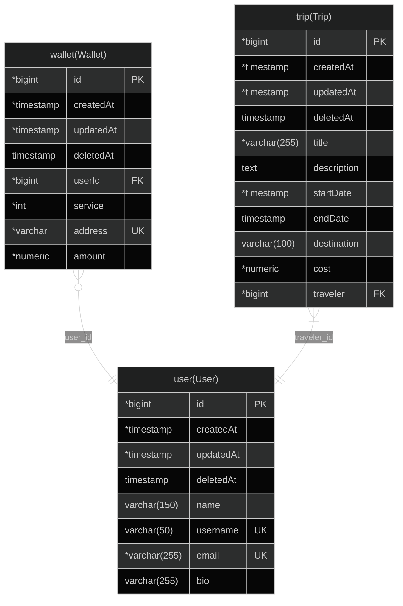

Using https://github.com/klerick/nestjs-json-api

# Getting started (Docker)

Make sure to download Docker before.

- Create `.env` as a copy of `.env.example`
- Provide JWT keys either by keeping `private_key.pem` / `public_key.pem` next to the `.env` (matching the `JWT_*_PATH` variables) or by pasting the key contents into `JWT_PRIVATE_KEY` / `JWT_PUBLIC_KEY` with literal `\n` line breaks; the Docker image generates a throwaway key pair automatically, so replace those files for real deployments
- run `make` and the containers will be build and the API will be available at port 3000

# Deploying to GCP (Terraform)

1. Copy `.env.example` to `.env` (runtime-only values) and `infra/terraform/.env.terraform.example` to `infra/terraform/.env.terraform` (Terraform-only values). When running Terraform, load the infra file so the `TF_VAR_*` inputs are exported: `set -a && source infra/terraform/.env.terraform && set +a`.
2. Authenticate with GCP (e.g. `gcloud auth application-default login` or export `GOOGLE_APPLICATION_CREDENTIALS` that points to a service-account JSON with permissions for Compute Engine, Cloud SQL, VPC, and Service Networking).
3. Push your Docker image to a registry that the VM can reach (public Docker Hub or Artifact Registry accessible by the VM service account).
4. Run Terraform from the repo root via the Make targets (they source `infra/terraform/.env.terraform` automatically):

- `make infra-init`
- `make infra-plan`
- `make infra-apply`

5. Terraform outputs the static VM IP plus Cloud SQL connection info. Point your DNS (if any) at the VM IP. The startup script installs Docker, writes an `.env` with your DB/JWT values, and runs the container on port 80.

Tip: store Terraform state in a GCS bucket for teams (configure a backend in `infra/terraform/versions.tf`) and rotate the Cloud SQL user password/JWT secret via `.env.terraform` before each apply. To tear everything down safely, run `make infra-destroy`.

# Generate Mermaid For Database

- Start the app with `make`
- Enter in app container `make app`
- Create the Mermaid Diagram with `npm run mermaid`.
- A `.md` file will be created
- The name of the file depends on your database name on your `.env`

### Mermaid Diagram

