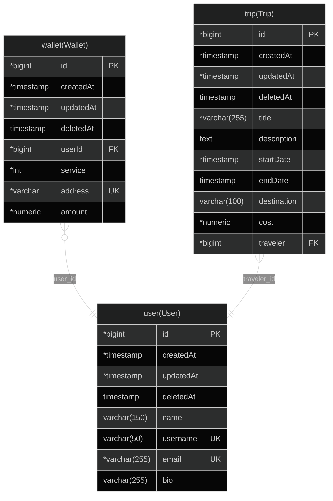

Using https://github.com/klerick/nestjs-json-api

# Getting started (Docker)

Make sure to download Docker before.

- Create `.env` as a copy of `.env.example`
- Provide JWT keys either by keeping `private_key.pem` / `public_key.pem` next to the `.env` (matching the `JWT_*_PATH` variables) or by pasting the key contents into `JWT_PRIVATE_KEY` / `JWT_PUBLIC_KEY` with literal `\n` line breaks; the Docker image generates a throwaway key pair automatically, so replace those files for real deployments
- run `make` and the containers will be build and the API will be available at port 3000

# Generate Mermaid For Database

- Start the app with `make`
- Enter in app container `make app`
- Create the Mermaid Diagram with `npm run mermaid`.
- A `.md` file will be created
- The name of the file depends on your database name on your `.env`

### Mermaid Diagram

