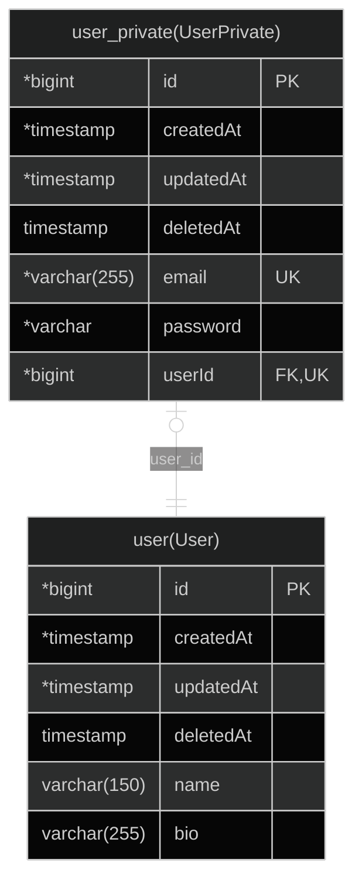

# root

## Table Of Contents

1. 1.0.0 Entities
   1. user(User)
   2. user_private(UserPrivate)
2. ER Diagram

## 1.0.0 Entities

### user(User)

#### user(User) columns

| Database Name | Property Name | Attribute | Type         | Nullable | Charset | Comment |
| ------------- | ------------- | --------- | ------------ | -------- | ------- | ------- |
| id            | id            | PK        | \*bigint     |          |         |         |
| created_at    | createdAt     |           | \*timestamp  |          |         |         |
| updated_at    | updatedAt     |           | \*timestamp  |          |         |         |
| deleted_at    | deletedAt     |           | timestamp    | Nullable |         |         |
| name          | name          |           | varchar(150) | Nullable |         |         |
| bio           | bio           |           | varchar(255) | Nullable |         |         |

### user_private(UserPrivate)

#### user_private(UserPrivate) columns

| Database Name | Property Name | Attribute | Type           | Nullable | Charset | Comment |
| ------------- | ------------- | --------- | -------------- | -------- | ------- | ------- |
| id            | id            | PK        | \*bigint       |          |         |         |
| created_at    | createdAt     |           | \*timestamp    |          |         |         |
| updated_at    | updatedAt     |           | \*timestamp    |          |         |         |
| deleted_at    | deletedAt     |           | timestamp      | Nullable |         |         |
| email         | email         | UK        | \*varchar(255) |          |         |         |
| password      | password      |           | \*varchar      |          |         |         |
| user_id       | userId        | FK,UK     | \*bigint       |          |         |         |

#### user_private(UserPrivate) indices

| Database Name                  | Property Name                  | Unique | Columns |
| ------------------------------ | ------------------------------ | ------ | ------- |
| UQ_f13f74bb715b655624db7fdc8a3 | UQ_f13f74bb715b655624db7fdc8a3 | Unique |         |
| UQ_419c70398b229b4a34ac7d7c981 | UQ_419c70398b229b4a34ac7d7c981 | Unique |         |
| REL_419c70398b229b4a34ac7d7c98 | REL_419c70398b229b4a34ac7d7c98 | Unique |         |

## ER Diagram

