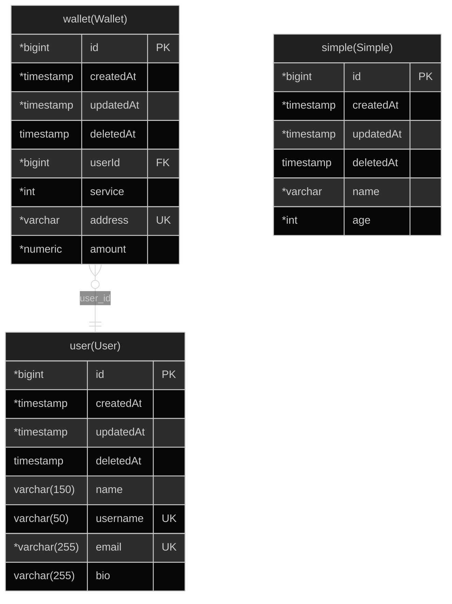

# root

## Table Of Contents

1. 1.0.0 Entities
   1. user(User)
   2. wallet(Wallet)
   3. simple(Simple)
2. ER Diagram

## 1.0.0 Entities

### user(User)

#### user(User) columns

| Database Name | Property Name | Attribute | Type           | Nullable | Charset | Comment |
| ------------- | ------------- | --------- | -------------- | -------- | ------- | ------- |
| id            | id            | PK        | \*bigint       |          |         |         |
| created_at    | createdAt     |           | \*timestamp    |          |         |         |
| updated_at    | updatedAt     |           | \*timestamp    |          |         |         |
| deleted_at    | deletedAt     |           | timestamp      | Nullable |         |         |
| name          | name          |           | varchar(150)   | Nullable |         |         |
| username      | username      | UK        | varchar(50)    | Nullable |         |         |
| email         | email         | UK        | \*varchar(255) |          |         |         |
| bio           | bio           |           | varchar(255)   | Nullable |         |         |

#### user(User) indices

| Database Name                  | Property Name                  | Unique | Columns |
| ------------------------------ | ------------------------------ | ------ | ------- |
| UQ_78a916df40e02a9deb1c4b75edb | UQ_78a916df40e02a9deb1c4b75edb | Unique |         |
| UQ_e12875dfb3b1d92d7d7c5377e22 | UQ_e12875dfb3b1d92d7d7c5377e22 | Unique |         |

### wallet(Wallet)

#### wallet(Wallet) columns

| Database Name | Property Name | Attribute | Type        | Nullable | Charset | Comment |
| ------------- | ------------- | --------- | ----------- | -------- | ------- | ------- |
| id            | id            | PK        | \*bigint    |          |         |         |
| created_at    | createdAt     |           | \*timestamp |          |         |         |
| updated_at    | updatedAt     |           | \*timestamp |          |         |         |
| deleted_at    | deletedAt     |           | timestamp   | Nullable |         |         |
| user_id       | userId        | FK        | \*bigint    |          |         |         |
| service       | service       |           | \*int       |          |         |         |
| address       | address       | UK        | \*varchar   |          |         |         |
| amount        | amount        |           | \*numeric   |          |         |         |

#### wallet(Wallet) indices

| Database Name                  | Property Name                  | Unique | Columns |
| ------------------------------ | ------------------------------ | ------ | ------- |
| UQ_1dcc9f5fd49e3dc52c6d2393c53 | UQ_1dcc9f5fd49e3dc52c6d2393c53 | Unique |         |

### simple(Simple)

#### simple(Simple) columns

| Database Name | Property Name | Attribute | Type        | Nullable | Charset | Comment |
| ------------- | ------------- | --------- | ----------- | -------- | ------- | ------- |
| id            | id            | PK        | \*bigint    |          |         |         |
| created_at    | createdAt     |           | \*timestamp |          |         |         |
| updated_at    | updatedAt     |           | \*timestamp |          |         |         |
| deleted_at    | deletedAt     |           | timestamp   | Nullable |         |         |
| name          | name          |           | \*varchar   |          |         |         |
| age           | age           |           | \*int       |          |         |         |

## ER Diagram

